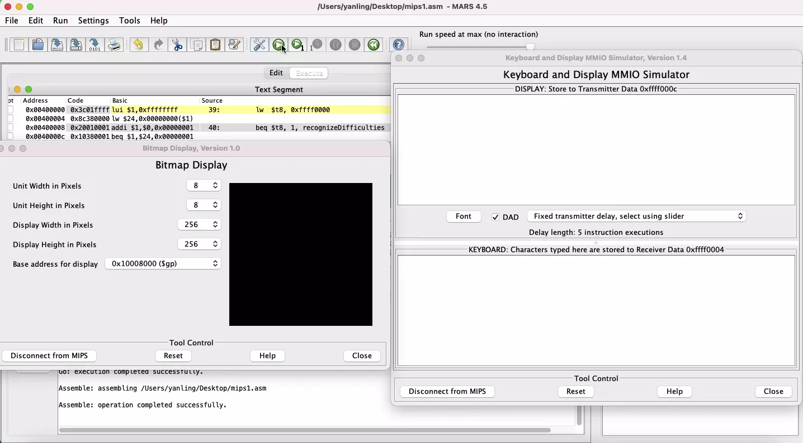

# Doodle-Jump
an **assembly** program that mimics the game [Doodle Jump](https://poki.com/en/g/doodle-jump?gclid=Cj0KCQjw59n8BRD2ARIsAAmgPmKehON9X3naoC33v2I_QRkieGRNlD_MGVsDSpaHmgLxGr8N57CuKAAaAqFDEALw_wcB). The project is demonstrated as following: 

**Game Control**:
1. type "s" to initial the game
2. choose difficulties by type 1 or 2 or 3 and end then end with another "s" to start the game
3. use keyboard "j", "k" to control the movement of Doodle

**Features**:
1. choose difficulties. There are three levels of difficulties and higher the level, short the stairs and lower each jump
2. stairs are randomly regenerated
3. screen boundaries are infinitely wrapping around

**Game termination condition**
1. when the green doodle hits the bottom of the screen, the game ends.
